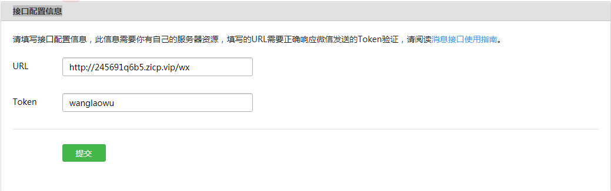
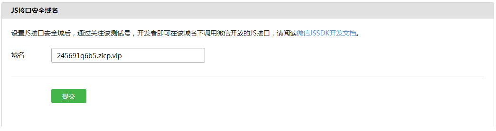

# 微信js-sdk使用流程

## 步骤一：微信公众号后台做相关设置

* 接口配置信息



如图配置两个参数：

url：配置一个后台接口，微信会带4个参数访问这个接口，后台需要拿到参数做验证后返回参数中的echostr才能验证成功

token: 自定义的字符串，后台做验证时需要用到

如图配置的话微信的访问链接如下：

http://245691q6b5.zicp.vip/wx?signature=da9c31d92c7d6368700dff3ff7fbc64490b14f4d&echostr=4513441039712648567&timestamp=1555868951&nonce=228899091

```javascript
//http://245691q6b5.zicp.vip/wx接口操作如下
//我的后台使用koa2
router.get('/wx', async (ctx, next) => {
    //1.解析参数
    const querystring = ctx.querystring;
    const tokenParams = getParams(querystring);
    const signature = tokenParams['signature'];
    const echostr = tokenParams['echostr'];
    const timestamp = tokenParams['timestamp'];
    const nonce = tokenParams['nonce'];
    const token = 'wanglaowu'; //如图配置的自定义token
    //2.token, timestamp, nonce排序后的字符串通过sha1加密
    let str = [token, timestamp, nonce].sort().join('');
    let sha = sha1(str);
    //3.加密后的字符串和signature比对，如果相等说明是微信的访问，返回echostr，即可验证成功，返回其他值验证失败。
    if (sha == signature) {
        ctx.body = echostr;
    } else {
        ctx.body = 'wrong';
    }
    //ps:可以不进行验证直接返回echostr也可以验证成功，但不建议这样做。
})

function getParams(querystring) {
    const rs = {}
    const kvArr = querystring.split('&');
    kvArr.forEach(item => {
        const temp = item.split('=')
        const key = temp[0];
        const val = temp[1];
        rs[key] = val
    })
    return rs
}

```

做好这些准备后，点击提交会有配置成功的提示。

* 配置JS接口安全域名



如图不需要http://或https://,点击提交即可

## 步骤二：后端获取使用weixin js-sdk需要的配置参数

```javascript
router.get('/wxapiconfig', async (ctx, next) => {
    //1.获取accessToken，用于获取访问wx的api的凭证；
    const accessToken = await getAccessToken()
    //2.获取jsapiTicket 用于访问wx的api的凭证
    const jsapiTicket = await getJsapiTicket(accessToken)
    //3.生成时间戳和随机字符串
    const nonceStr = randomString(16)//随机字符串
    const timestamp = (Date.now()/1000).toFixed();//时间戳
    const url = 'http://245691q6b5.zicp.vip/wx'
    //4.按照微信官方要求拼接字符串
    const str = `jsapi_ticket=${jsapiTicket}&noncestr=${nonceStr}&timestamp=${timestamp}&url=${url}`
    //5.sha1加密后获得signature参数
    const signature = sha1(str);
    //6.通过官方工具验证signature的正确性：//https://mp.weixin.qq.com/debug/cgi-bin/sandbox?t=jsapisign

    //7.将参数返给前端
    ctx.body = JSON.stringify({
        jsapiTicket,
        nonceStr,
        timestamp,
        signature,
        jsApiList: ['updateAppMessageShareData'] //需要请求的接口，也可以在前端使用时增加此参数
    })
})

function getAccessToken() {
    const url = `https://api.weixin.qq.com/cgi-bin/token?grant_type=client_credential&appid=${appid}&secret=${appsecret}`
    return Superagent.get(url).then(res => {
        return JSON.parse(res.text).access_token
    })
}

function getJsapiTicket(accessToken) {
    const url = `https://api.weixin.qq.com/cgi-bin/ticket/getticket?access_token=${accessToken}&type=jsapi`
    return Superagent.get(url).then(res => {
        return JSON.parse(res.text).ticket
    })
}

function randomString(len) {
    len = len || 32;
    var chars = 'ABCDEFGHJKMNPQRSTWXYZabcdefhijkmnprstwxyz2345678';    
    var maxPos = chars.length;
    var pwd = '';
    for (i = 0; i < len; i++) {
        pwd += chars.charAt(Math.floor(Math.random() * maxPos));
    }
    return pwd;
}


```
## 步骤三：前端拿到参数后使用js-sdk进行接口调用

* 在需要调用JS接口的页面引入如下JS文件，（支持https）：http://res.wx.qq.com/open/js/jweixin-1.4.0.js

* 所有需要使用JS-SDK的页面必须先注入配置信息，否则将无法调用（同一个url仅需调用一次，对于变化url的SPA的web app可在每次url变化时进行调用

```javascript
wx.config({
    debug: true, // 开启调试模式,调用的所有api的返回值会在客户端alert出来，若要查看传入的参数，可以在pc端打开，参数信息会通过log打出，仅在pc端时才会打印。
    appId: '', // 必填，公众号的唯一标识
    timestamp: , // 必填，生成签名的时间戳（上一步中后端返回的参数）
    nonceStr: '', // 必填，生成签名的随机串（上一步中后端返回的参数）
    signature: '',// 必填，签名（上一步中后端返回的参数）
    jsApiList: [] // 必填，需要使用的JS接口列表（上一步中后端返回的参数，也可在前端配置此参数）
});
```

* 接口调用见官网使用教程：https://mp.weixin.qq.com/wiki?t=resource/res_main&id=mp1421141115