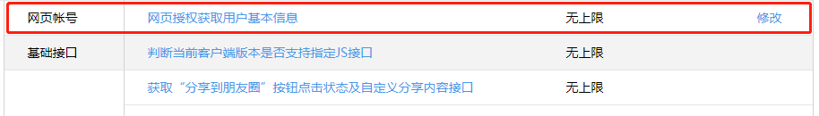
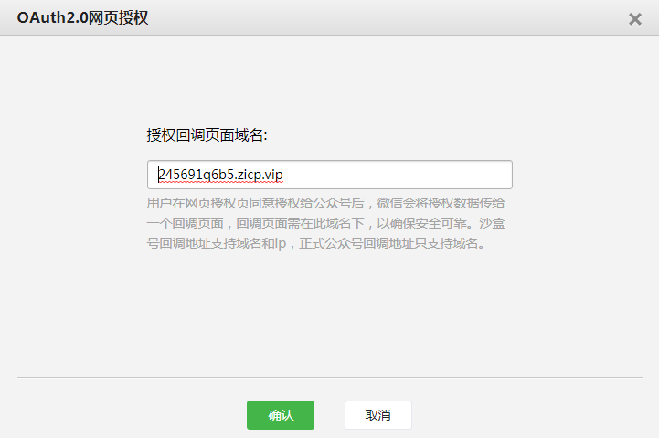

# 微信公众号网页授权获取用户信息的流程

## 步骤一：公众号后台相关设置




## 步骤二：用户同意授权，获取code码，可以是前端获取，也可以是后端获取

* 获取用户授权需要按照微信规定拼装链接，让用户访问，链接如下：

```javascript
const appid = "wx3b0e58d4d2dbea9f";  //公众号后台获取
const redirectUri = "http://245691q6b5.zicp.vip" //微信会带code码访问这个链接

const url = `https://open.weixin.qq.com/connect/oauth2/authorize?appid=${appid}&redirect_uri=${redirectUri}&response_type=code&scope=snsapi_userinfo&state=STATE#wechat_redirect`

```
* 前端获取

如果不是每次进入页面都要从微信获取code码时（用户信息），建议在前端获取，需要时才改变浏览器链接让用户访问链接获取授权，把code码传给后端获取用户信息。

```javascript
const querystring = getQueryString()
let code = querystring.code;

if(!code){
    location.href = url;
}else{
    https.get('http://127.0.0.1:3000/auth',{code}).then(res => {
      console.log(res)
    })
}

function getQueryString() {
    const url = location.search;
    const rs = {}
    if(url.indexOf('?') === 0){
        const querystring = url.subStr(1);
        const kvArr = querystring.split('&');
        kvArr.forEach(item => {
            const temp = item.split('=')
            const key = temp[0];
            const val = temp[1];
            rs[key] = val
        })
    }
    return rs
}

```
* 后端获取

如果每次都要获取code码，就让用户只要进入页面就访问接口链接，但这时的redirectUri要配置成后端接口的链接，也就是说微信会带着code码访问后端接口，后端直接获取code码。

```javascript
//后端使用koa2
//Superagent时一个后端的http请求中间件
router.get('/auth', async (ctx, next) => {
    code = ctx.querystring.split('&')[0].split('=')[1];
    // 使用code获取openid和access_token 
    await Superagent
        .get(`https://api.weixin.qq.com/sns/oauth2/access_token?appid=${appid}&secret=${appsecret}&code=${code}&grant_type=authorization_code`)
        .then(res => {
            let result = JSON.parse(res.text)
            access_token = result.access_token
            openid = result.openid
        })

    // 使用ACCESS_TOKEN和openid
    await Superagent
        .get(`https://api.weixin.qq.com/sns/userinfo?access_token=${access_token}&openid=${openid}&lang=zh_CN`)
        .then(res => {
            //userinfo返回给前端
            userinfo = JSON.parse(res.text)
            ctx.body = res.text
        })
})
```

* 官方教程：https://mp.weixin.qq.com/wiki?t=resource/res_main&id=mp1421140842